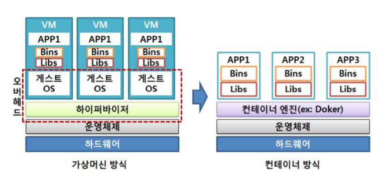
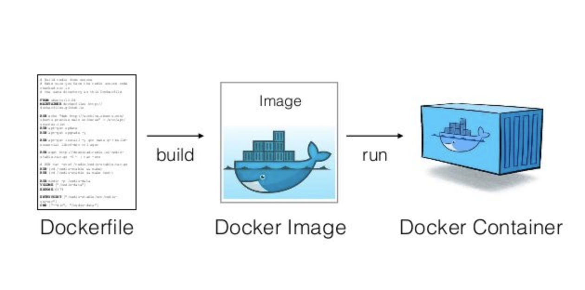

# Docker란?

- **리눅스의 응용 프로그램**들을 격리 기술들을 사용해 **컨테이너**로 실행하고 관리
- **컨테이너**를 사용하여 응용프로그램을 좀더 쉽게 **배포**할 수 있도록 도와주는 도구

 

# 컨테이너??

- 프로그램을 쉽게 배포하기 위하여 **코드와 모든 종속성을 패키지화** 하여 다른 환경에서도 안정적으로 실행이 가능하도록 하는 도구
- 패키징을 통하여 의존성을 통합함으로서 **언제든 동일한 환경**으로 배포가 가능!
- 기존의 가상화 머신( Virtual Machine)은 운영체제 위에 게스트 OS를 포함하여 무겁고 느리다
- 하지만 컨테이너는 운영체제를 공유함으로써 가볍고 빠르다!

 

# Docker Image??

- Docker Image는 Container를 생성하기 위하여  필요한 설정 및 족속성을 가지고 있다!
- 그렇기 때문에 Docker Image를 통해 Container를 생성하고 Container의 내용을 수정하고 싶다면 Image를 변경하여 재배포!

