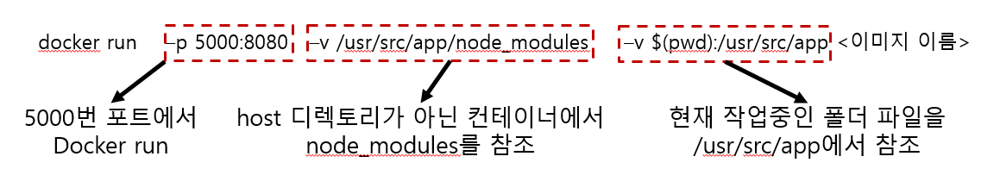

# Docker Volume이란?

-   Docker는 기본적으로 Image를 사용하여 컨테이너를 제작합니다.

-   Docker는 컨테이너를 제작할 때 Image를 읽기전용으로 사용하기는 특징이 있습니다.

-   이러한 특징으로 인해 내용을 일부분만 변경하더라도 다시 Build 해주어야만 변경사항을 반영할 수 있습니다.

-   또한 컨테이너에 데이터가 영속되어 컨테이너를 삭제할 경우, 데이터도 삭제되는 문제가 있습니다.

-   이럴때 사용하는 것이 Docker Volume 입니다.

Docker Volume은 Copy와 다르게 컨테이너의 특정 폴더를 Host에 연결합니다.

컨테이너가 지정된 디렉토리를 지속적으로 참조하기 때문에 디렉토리의 내용이 변경되었을 경우, 즉각적으로 반응합니다.

- 위 그림에서 보이듯이 -v A:B 일경우, Host의 A와 컨테이너의 B를 연결해준다.
- 또한 -v C 는 host에서 참조할 폴더는 없고 컨테이너의 C를 참조해줍니다.